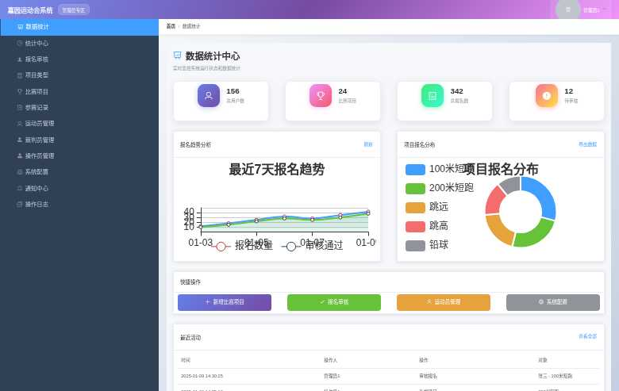

                                                                                                                                                                                                                                                                                                                                                                                                                                                                                                                                                                                                                                                                                                                                                                                                                                                                                                                                                                                                                                                                                                                                                                                                                                                                                                                                                                                                                                                                                                                                                                                                                                                                                                                                                                                                                                                                                                                                                                                                                                                                                                                                                                                                                                                                                                                                                                                                                                                                                                                                                                                                                                                                                                                                                                                                                                                                                                                                                                                                                                                                                                                                                                                                                                                                                                                                                                                                                                                                                                                                                                                                                                                                                                                                                                                                                                                                                                                                                                                                                                                                                                                                                                                                                                                                                                                                                                                                                                                                                                                                                                                                                                                                                                                                                                                                                                                                                                                                                                                                                                                                                                                                                                                                                                                                                                                                                                                                                                                                                                                                                                                                                                                                                                                                                                                                                                                                                                                                                                                                                                                                                                                                                                                                                                                                                                                                                                                                                                                                                                                                                                                                                                                                                                                                                                                                                                                                                                                                                                                                                                                                                                                                                                                                                                                                                                                                                                                                                                                                                                                                                                                                                                                                                                                                                                                                                                                                                                                                                                                                                                                                                                                                                                                                                                                                                                                                                                                                                                                                                                                                                                                                                                                                                                                                                                                                                                                                                                                                                                                                                                                                                                                                                                                                                                                                                                                                                                                                                                                                                                                                                                                                                                                                                                                                                                                                                                                                                                                                                                                                                                                                                                                                                                                                                                                                                                                                                                                                                                                                                                                                                                                                                                            # 第5章 系统实现

## 5.1 多角色登录系统

### 5.1.1 角色选择功能

系统采用多角色登录设计，支持管理员、运动员、裁判员三种不同身份的用户登录。用户首先需要在登录页面选择自己的身份类型，系统会根据选择的角色跳转到对应的登录界面。角色选择界面采用卡片式设计，每个角色卡片包含角色图标、角色名称和功能描述，用户点击相应卡片后点击"确认选择"按钮即可进入对应的登录页面。角色选择界面如图5-1所示。

图5-1 多角色登录选择界面

### 5.1.2 用户身份认证

系统为不同角色提供了专门的登录界面，每个登录界面都包含相应的测试账号信息供用户参考。管理员登录需要输入管理员用户名和密码，运动员登录需要输入学号和密码，裁判员登录需要输入裁判员用户名和密码。系统采用JWT（JSON Web Token）技术实现用户身份认证，确保登录安全性。登录成功后，系统会根据用户角色自动跳转到对应的主页面。

## 5.2 管理员系统

### 5.2.1 项目类型管理

管理员可以对比赛项目类型进行全面管理，包括查看、新增、修改和删除项目类型。项目类型管理界面采用表格形式展示所有项目类型信息，包括项目名称、项目说明等基本信息。界面顶部提供快速查询功能，管理员可以通过输入项目名称进行模糊搜索。每个项目类型记录都提供修改和删除操作按钮，方便管理员进行数据维护。系统预置了田赛、径赛、游泳项目、球类项目、体操项目、武术项目等常见运动项目类型。项目类型管理界面如图5-2所示。

图5-2 管理员项目类型管理界面

### 5.2.2 数据统计中心

管理员系统提供了完善的数据统计功能，实时监控系统运行状态和各项数据指标。数据统计中心包含四个核心统计指标：总用户数、比赛项目数、总报名数和待审核报名数。这些数据以卡片形式展示，每个卡片都配有相应的图标和渐变色背景，视觉效果美观。统计中心还提供报名趋势分析图表和项目报名分布图表，帮助管理员直观了解系统使用情况。界面下方展示快捷操作按钮，包括新增比赛项目、报名审核、运动员管理、系统配置等常用功能，提高管理效率。最近活动列表显示系统的操作日志，包括操作时间、操作人、操作类型和操作对象等详细信息。数据统计中心界面如图5-3所示。

图5-3 管理员数据统计中心界面

### 5.2.3 系统导航功能

管理员系统采用左侧菜单栏的导航设计，菜单项包括数据统计、统计中心、报名审核、项目类型、比赛项目、参赛记录、运动员管理、裁判员管理、操作员管理、系统配置、通知中心、操作日志等功能模块。菜单栏采用深色背景设计，与头部的蓝紫渐变形成良好的视觉对比。每个菜单项都配有相应的图标，提升用户体验。系统头部显示"嘉园运动会系统"标题和"管理员专区"标识，右侧显示当前登录用户的头像和姓名，点击可展开下拉菜单进行个人信息管理和退出登录操作。

## 5.3 运动员系统

### 5.3.1 个人中心功能

运动员登录系统后首先进入个人中心页面，该页面展示运动员的基本信息和统计数据。页面顶部显示个性化的欢迎信息，包括运动员姓名、学号、班级、编号等基本信息，以及上次登录时间。个人统计数据以卡片形式展示，包括总报名数、已确认报名数、参赛次数和最佳成绩等关键指标，每个统计卡片都配有相应的图标和数值显示。快捷操作区域提供三个主要功能入口：项目报名、我的报名和成绩查询，每个功能都有详细的说明文字，方便运动员快速找到所需功能。页面下方展示最近比赛成绩列表，包括项目名称、比赛日期、成绩和操作按钮等信息。运动员个人中心界面如图5-4所示。

图5-4 运动员个人中心界面

### 5.3.2 系统导航功能

运动员系统同样采用左侧菜单栏导航设计，菜单项包括个人中心、报名管理（包含项目报名和我的报名子菜单）、我的成绩、通知中心、个人信息等功能模块。通知中心菜单项显示未读通知数量徽章，提醒运动员及时查看重要通知。系统头部保持与管理员系统一致的设计风格，显示"嘉园运动会系统"标题和"运动员专区"标识，确保用户能够清楚识别当前所在的系统模块。

## 5.4 裁判员系统

### 5.4.1 个人中心功能

裁判员个人中心页面展示裁判员的工作概况和统计信息。页面顶部显示个性化欢迎信息，包括裁判员姓名和当日执裁安排提醒。工作统计数据以卡片形式展示，包括分配赛事数、已完成赛事数、录入成绩数和待执裁赛事数等关键工作指标。快捷操作区域提供我的赛事、成绩录入、个人信息三个主要功能入口，帮助裁判员快速访问常用功能。今日赛事安排表格显示当日需要执裁的比赛项目，包括比赛项目、开始时间、结束时间、报名人数、已录成绩、进度和操作等详细信息。最近录入成绩列表展示裁判员近期的成绩录入记录，包括比赛项目、运动员、参赛号、成绩、比赛日期和操作等信息。裁判员个人中心界面如图5-5所示。

图5-5 裁判员个人中心界面

### 5.4.2 系统导航功能

裁判员系统的左侧菜单栏包括个人中心、赛事管理（包含我的赛事和执裁安排子菜单）、成绩管理（包含成绩录入和成绩管理子菜单）、通知中心、个人信息等功能模块。通知中心同样显示未读通知数量徽章，确保裁判员能够及时获取重要工作通知。系统头部显示"嘉园运动会系统"标题和"裁判员专区"标识，保持与其他系统模块的视觉一致性。

## 5.5 统一样式系统

### 5.5.1 视觉设计统一性

系统采用统一的视觉设计语言，三个子系统（管理员、运动员、裁判员）都使用相同的蓝紫渐变头部设计，确保用户在不同系统间切换时保持一致的视觉体验。头部采用现代化的渐变色彩搭配，从深蓝色（#667eea）过渡到紫色（#764ba2）再到粉色（#f093fb），营造出专业而富有活力的视觉效果。

### 5.5.2 交互体验优化

系统在多个细节处采用了现代化的交互设计，包括毛玻璃效果的用户下拉菜单、平滑的悬停动画效果、统一的卡片阴影设计等。这些设计元素不仅提升了系统的视觉美感，也改善了用户的操作体验。所有按钮和交互元素都提供了清晰的视觉反馈，帮助用户更好地理解系统状态和操作结果。

### 5.5.3 响应式布局设计

系统采用响应式布局设计，能够适配不同尺寸的设备屏幕。通过使用rem单位和媒体查询技术，确保系统在桌面端、平板端和移动端都能提供良好的用户体验。布局采用弹性设计，能够根据屏幕尺寸自动调整内容排列和间距，保证信息的可读性和操作的便利性。

## 5.6 权限管理系统

### 5.6.1 基于角色的访问控制

系统实现了完善的基于角色的访问控制（RBAC）机制，不同角色的用户只能访问其权限范围内的功能模块。管理员拥有系统的最高权限，可以管理所有用户、项目、比赛和系统配置；运动员只能访问与自己相关的报名、成绩查询等功能；裁判员主要负责成绩录入和赛事管理相关功能。系统通过JWT令牌技术实现用户身份验证和权限控制，确保数据安全和操作合规性。

### 5.6.2 菜单权限控制

系统根据用户角色动态生成菜单项，确保用户只能看到自己有权限访问的功能模块。这种设计不仅提高了系统的安全性，也简化了用户界面，避免了无关功能对用户造成的困扰。每个菜单项都与后端权限验证机制关联，即使用户通过其他方式访问无权限的页面，系统也会进行拦截并提示权限不足。

## 5.7 数据管理功能

### 5.7.1 用户信息管理

系统提供完善的用户信息管理功能，管理员可以对运动员、裁判员和操作员的基本信息进行增删改查操作。用户信息包括姓名、学号/工号、联系方式、所属班级/部门等基本信息。系统支持批量导入用户信息，提高数据录入效率。用户信息修改需要经过相应的审核流程，确保数据的准确性和完整性。

### 5.7.2 比赛项目管理

管理员可以创建和管理各种比赛项目，包括项目名称、项目类型、比赛规则、报名限制、比赛时间等详细信息。系统支持个人项目和团体项目的管理，可以设置不同的报名条件和参赛要求。比赛项目创建后，系统会自动开放报名通道，运动员可以根据自己的情况选择合适的项目进行报名。

### 5.7.3 成绩录入与查询

裁判员可以通过系统录入比赛成绩，支持单个录入和批量录入两种方式。成绩录入界面提供参赛运动员列表，裁判员可以快速定位到具体运动员并录入相应成绩。系统会自动计算排名和统计信息，生成成绩报表。运动员可以通过个人中心查询自己的比赛成绩和排名情况，系统提供多种查询条件和排序方式，方便用户快速找到所需信息。

## 5.8 通知消息系统

### 5.8.1 消息推送功能

系统内置了完善的消息通知功能，支持系统通知、比赛通知、成绩通知等多种类型的消息推送。管理员可以向特定角色或全体用户发送通知消息，消息内容支持富文本格式，可以包含文字、链接等多种元素。系统会在用户登录时自动检查未读消息，并在相应菜单项上显示未读消息数量徽章。

### 5.8.2 消息管理功能

用户可以在通知中心查看所有收到的消息，包括已读和未读消息。消息列表按时间倒序排列，用户可以快速浏览最新的通知信息。系统提供消息搜索和筛选功能，用户可以根据消息类型、发送时间等条件快速找到特定消息。重要消息会以不同的颜色或图标进行标识，确保用户不会错过关键信息。

## 5.9 系统配置管理

### 5.9.1 基础配置功能

管理员可以通过系统配置模块对系统的基础参数进行设置，包括系统名称、Logo、联系方式、报名时间限制、成绩录入规则等。这些配置项采用键值对的形式存储，支持动态修改和实时生效。系统提供配置项的分类管理，方便管理员快速找到需要修改的配置项。

### 5.9.2 操作日志记录

系统自动记录所有重要操作的日志信息，包括用户登录、数据修改、权限变更等操作。操作日志包含操作时间、操作人、操作类型、操作对象、操作结果等详细信息，为系统安全审计和问题排查提供重要依据。管理员可以通过操作日志查询功能，按时间范围、操作人、操作类型等条件查询历史操作记录。

## 5.10 系统特色功能

### 5.10.1 智能报名限制

系统实现了智能的报名限制功能，可以根据比赛项目的特点设置不同的报名条件。例如，可以限制每个运动员最多报名的项目数量、限制特定项目的参赛人数上限、设置报名的时间窗口等。系统会在运动员报名时自动检查这些限制条件，防止违规报名的发生。

### 5.10.2 数据统计分析

系统提供丰富的数据统计分析功能，可以生成各种统计报表和图表。包括报名统计、成绩分析、参与度统计等多个维度的数据分析。这些统计信息以图表形式直观展示，帮助管理员了解运动会的整体情况和发展趋势，为决策提供数据支持。                                                                                                                                                                                                                                                                                                                                                                                                                                                                                                                                                                                                                                                                                                                                                                                                                                                                                                                                                                                                                                                                                                                                                                                                                                                                                                                                                                                                                                                                                                                                                                                                                                                                                                                                                                                                                                                                                                                                                                                                                                                                                                                                                                                                                                                                                                                                                                                                                                                                                                                                                                                                                                                                                                                                                                                                                                                                                                                                                                                                                                                                                                                                                                                                                                                                                                                                                                                                                                                                                                                                                                                                                                                                                                                                                                                                                                                                                                                                                                                                                                                                                                                                                                                                                                                                                                                                                                                                                                                                                                                                                                                                                                                                                                                                                                                                                                                                                                                                                                                                                                                                                                                                                                                                                                                                                                                                                                                                                                                                                                                                                                                                                                                                                                                                                                                                                                                                                                                                                                                                                                                                                                                                                                                                                                                                                                                                                                                                                                                                                                                                                                                                                                                                                                                                                                                                                                                                                                                                                                                                                                                                                                                                                                                                                                                                                                                                                                                                                                                                                                                                                                                                                                                                                                                                                                                                                                                                                                                                                                                                                                                                                                                                                                                                                                                                                                                                                                                                                                                                                                                                                                                                                                                                                                                                                                                                                                                                                                                                                                                                                                                                                                                                                                                                                                                                                                                                                                                                                                                                                                                                                                                                                                                                                                                                                                                                                                                                                                                                                                                                                                                                                                                                                                                                                                                                                                                                                                                                                                                                                                                                                                                                                                          

### 5.10.3 移动端适配

系统采用响应式设计，完美适配移动设备。用户可以通过手机或平板电脑访问系统，进行报名、查询成绩、查看通知等操作。移动端界面经过专门优化，确保在小屏幕设备上也能提供良好的用户体验。触控操作经过精心设计，按钮大小和间距都符合移动设备的操作习惯。
